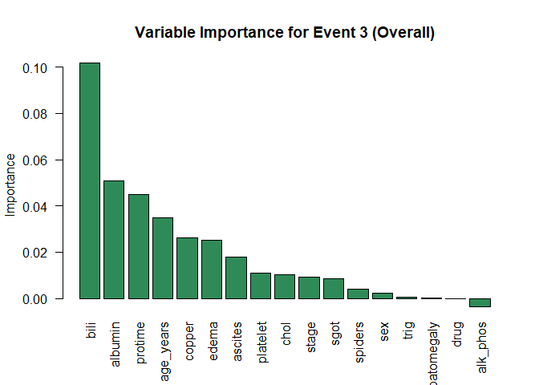

Survival Analysis with Machine Learning on PBC dataset
================
Rony Zafrir

# Introduction

In this project, we analyze survival data from a clinical study on
Primary Biliary Cirrhosis (PBC), a chronic liver disease. Our objective
is to compare traditional survival models, such as the Cox Proportional
Hazards model, with modern machine learning approaches, including Random
Survival Forests and a deep learning-based survival model (DeepHit). The
dataset includes time-to-event information (death or liver transplant)
and various clinical covariates for over 300 patients. We assess model
performance using standard metrics such as the Concordance Index
(C-index) and Integrated Brier Score (IBS). Our analysis revealed that
the treatment variable (D-penicillamine vs. placebo) did not have a
significant impact on patient survival, aligning with clinical findings
that questioned the drug’s efficacy. Also, Random Survival Forests
achieved the best overall performance, with the lowest Integrated Brier
Score and the highest C-index, suggesting strong predictive ability and
good calibration.

# The Primiary Biliary Cirrhosis Dataset

This clinical dataset is derived from a ten-year-study conducted to
investigate the nature and treatment outcomes of primary biliary
cirrhosis, a chronic liver disease. Patients were treated with
D-penicillamine or placebo. The dataset contains various clinical and
laboratory measurements, as well as information on time to death or
liver transplant, along with censoring status.

    ## 
    ##  Dimensions of the dataset:  312 20 
    ##  Number of rows with missing values:  36 
    ##  Number of columns with missing values:  4 
    ##  Columns with missing values:  chol, copper, trig, platelet 
    ##  Total number of missing values:  64 
    ##  Numeric variables:  time, age, bili, chol, albumin, copper, alk_phos, sgot, trig, platelet, protime 
    ##  Categorical variables:  status, drug, sex, ascites, hepatomegaly, spiders, edema, stage

    ##   id time status drug   age sex ascites hepatomegaly spiders edema bili chol
    ## 1  1  400      2    1 21464   1       1            1       1   1.0 14.5  261
    ## 2  2 4500      0    1 20617   1       0            1       1   0.0  1.1  302
    ## 3  3 1012      2    1 25594   0       0            0       0   0.5  1.4  176
    ## 4  4 1925      2    1 19994   1       0            1       1   0.5  1.8  244
    ## 5  5 1504      1    2 13918   1       0            1       1   0.0  3.4  279
    ## 6  6 2503      2    2 24201   1       0            1       0   0.0  0.8  248
    ##   albumin copper alk_phos   sgot trig platelet protime stage
    ## 1    2.60    156   1718.0 137.95  172      190    12.2     4
    ## 2    4.14     54   7394.8 113.52   88      221    10.6     3
    ## 3    3.48    210    516.0  96.10   55      151    12.0     4
    ## 4    2.54     64   6121.8  60.63   92      183    10.3     4
    ## 5    3.53    143    671.0 113.15   72      136    10.9     3
    ## 6    3.98     50    944.0  93.00   63       NA    11.0     3

# Variables description:

id: case number time: number of days until censoring, death or liver
transplant status: 0=alive, 1=transplanted, 2=dead drug: 1=
D-penicillamine (treatment), 2=placebo age: age in days, at registration
sex: 0=male, 1=female ascites: 0=no, 1=yes hepatomegaly: 0=no, 1=yes
spiders: 0=no, 1=yes edema: 0=no, 0.5 = edema present without diuretics,
1 = edema despite diuretic therapy bili: bilirubin results in mg/dl
chol: cholesterol results in mg/dl albumin: albumin results in mg/dl
copper: urine copper in ug/day alk_phos: alkaline phosphatase results in
U/liter sgot: SGOT results in U/ml trig: triglycerides results in mg/dl
platelet: platelets per cubic ml / 1000 protime: prothrombin time in
seconds stage: histologic stage of disease (1 = early, 2 = mild, 3 =
advanced, 4 = late)}

# Descriptive Statistics

## Status Distribution

<!-- -->

## Stage Distribution

<!-- -->

## Correlation Matrix Plot

<!-- -->

It seems that the covariates are not highly correlated with each other,
which is a good sign for our analysis.

## Histograms

<!-- -->

<!-- --><!-- -->

## Box-Plots

<!-- -->
<!-- -->

<!-- -->

# Cox Proportional Hazards Model

The Cox proportional hazards model is a semi-parametric regression
model, used to examine the effect of multiple variables on the time to
event. The model doesn’t require specification of the baseline hazard
function $h_0(t)$.

## Death as the Event of Interest

### Model

    ## Call:
    ## coxph(formula = Surv(time, status_death) ~ factor(drug) + age_years + 
    ##     sex + ascites + hepatomegaly + spiders + factor(edema) + 
    ##     bili + chol + albumin + copper + alk_phos + sgot + trig + 
    ##     platelet + protime + factor(stage), data = data, na.action = na.exclude)
    ## 
    ##   n= 276, number of events= 111 
    ##    (36 observations deleted due to missingness)
    ## 
    ##                        coef  exp(coef)   se(coef)      z Pr(>|z|)   
    ## factor(drug)2    -1.765e-01  8.382e-01  2.189e-01 -0.806  0.42003   
    ## age_years         2.889e-02  1.029e+00  1.164e-02  2.483  0.01304 * 
    ## sex              -3.757e-01  6.868e-01  3.111e-01 -1.208  0.22720   
    ## ascites           5.899e-04  1.001e+00  3.951e-01  0.001  0.99881   
    ## hepatomegaly      5.648e-02  1.058e+00  2.565e-01  0.220  0.82575   
    ## spiders           7.011e-02  1.073e+00  2.491e-01  0.281  0.77839   
    ## factor(edema)0.5  2.436e-01  1.276e+00  3.354e-01  0.726  0.46764   
    ## factor(edema)1    1.146e+00  3.146e+00  4.166e-01  2.751  0.00595 **
    ## bili              8.014e-02  1.083e+00  2.628e-02  3.050  0.00229 **
    ## chol              4.731e-04  1.000e+00  4.534e-04  1.043  0.29675   
    ## albumin          -7.496e-01  4.725e-01  3.104e-01 -2.415  0.01572 * 
    ## copper            2.442e-03  1.002e+00  1.171e-03  2.087  0.03693 * 
    ## alk_phos          5.228e-07  1.000e+00  4.066e-05  0.013  0.98974   
    ## sgot              3.710e-03  1.004e+00  1.992e-03  1.863  0.06247 . 
    ## trig             -5.177e-04  9.995e-01  1.436e-03 -0.361  0.71846   
    ## platelet          8.410e-04  1.001e+00  1.189e-03  0.707  0.47929   
    ## protime           2.763e-01  1.318e+00  1.167e-01  2.367  0.01793 * 
    ## factor(stage)2    1.406e+00  4.081e+00  1.080e+00  1.302  0.19288   
    ## factor(stage)3    1.683e+00  5.380e+00  1.052e+00  1.600  0.10968   
    ## factor(stage)4    2.119e+00  8.325e+00  1.067e+00  1.985  0.04711 * 
    ## ---
    ## Signif. codes:  0 '***' 0.001 '**' 0.01 '*' 0.05 '.' 0.1 ' ' 1
    ## 
    ##                  exp(coef) exp(-coef) lower .95 upper .95
    ## factor(drug)2       0.8382     1.1930    0.5458    1.2872
    ## age_years           1.0293     0.9715    1.0061    1.0531
    ## sex                 0.6868     1.4560    0.3732    1.2637
    ## ascites             1.0006     0.9994    0.4613    2.1704
    ## hepatomegaly        1.0581     0.9451    0.6400    1.7494
    ## spiders             1.0726     0.9323    0.6582    1.7479
    ## factor(edema)0.5    1.2759     0.7838    0.6611    2.4623
    ## factor(edema)1      3.1456     0.3179    1.3901    7.1178
    ## bili                1.0834     0.9230    1.0291    1.1407
    ## chol                1.0005     0.9995    0.9996    1.0014
    ## albumin             0.4725     2.1162    0.2572    0.8682
    ## copper              1.0024     0.9976    1.0001    1.0047
    ## alk_phos            1.0000     1.0000    0.9999    1.0001
    ## sgot                1.0037     0.9963    0.9998    1.0076
    ## trig                0.9995     1.0005    0.9967    1.0023
    ## platelet            1.0008     0.9992    0.9985    1.0032
    ## protime             1.3183     0.7586    1.0487    1.6572
    ## factor(stage)2      4.0811     0.2450    0.4914   33.8956
    ## factor(stage)3      5.3797     0.1859    0.6845   42.2793
    ## factor(stage)4      8.3253     0.1201    1.0274   67.4610
    ## 
    ## Concordance= 0.848  (se = 0.018 )
    ## Likelihood ratio test= 169.7  on 20 df,   p=<2e-16
    ## Wald test            = 175  on 20 df,   p=<2e-16
    ## Score (logrank) test = 295.6  on 20 df,   p=<2e-16

### Model Results with Benjamini-Hochberg Adjustment for Multiple Comparisons

    ##                    Coefficient  Exp_Coef Std_Error      Z_value     P_value
    ## factor(drug)2    -1.764941e-01 0.8382037 0.8382037 2.188732e-01 0.420026093
    ## age_years         2.889247e-02 1.0293139 1.0293139 1.163735e-02 0.013037739
    ## sex              -3.757134e-01 0.6867992 0.6867992 3.111258e-01 0.227203816
    ## ascites           5.899022e-04 1.0005901 1.0005901 3.950741e-01 0.998808644
    ## hepatomegaly      5.648049e-02 1.0581060 1.0581060 2.565448e-01 0.825747776
    ## spiders           7.011370e-02 1.0726301 1.0726301 2.491425e-01 0.778388175
    ## factor(edema)0.5  2.436387e-01 1.2758832 1.2758832 3.354401e-01 0.467639259
    ## factor(edema)1    1.145989e+00 3.1455523 3.1455523 4.166442e-01 0.005950019
    ## bili              8.014384e-02 1.0834429 1.0834429 2.627902e-02 0.002290494
    ## chol              4.731342e-04 1.0004732 1.0004732 4.534396e-04 0.296747430
    ## albumin          -7.496286e-01 0.4725420 0.4725420 3.103665e-01 0.015722194
    ## copper            2.442356e-03 1.0024453 1.0024453 1.170515e-03 0.036927431
    ## alk_phos          5.228338e-07 1.0000005 1.0000005 4.066476e-05 0.989741743
    ## sgot              3.710437e-03 1.0037173 1.0037173 1.991674e-03 0.062465947
    ## trig             -5.177290e-04 0.9994824 0.9994824 1.436062e-03 0.718458403
    ## platelet          8.409566e-04 1.0008413 1.0008413 1.188733e-03 0.479293575
    ## protime           2.763079e-01 1.3182537 1.3182537 1.167352e-01 0.017934679
    ## factor(stage)2    1.406372e+00 4.0811235 4.0811235 1.080077e+00 0.192880916
    ## factor(stage)3    1.682640e+00 5.3797404 5.3797404 1.051886e+00 0.109678131
    ## factor(stage)4    2.119304e+00 8.3253398 8.3253398 1.067492e+00 0.047109863
    ##                  Adjusted_P_value
    ## factor(drug)2          0.63905810
    ## age_years              0.07173872
    ## sex                    0.41309785
    ## ascites                0.99880864
    ## hepatomegaly           0.91749753
    ## spiders                0.91575079
    ## factor(edema)0.5       0.63905810
    ## factor(edema)1         0.05950019
    ## bili                   0.04580988
    ## chol                   0.49457905
    ## albumin                0.07173872
    ## copper                 0.12309144
    ## alk_phos               0.99880864
    ## sgot                   0.15616487
    ## trig                   0.89807300
    ## platelet               0.63905810
    ## protime                0.07173872
    ## factor(stage)2         0.38576183
    ## factor(stage)3         0.24372918
    ## factor(stage)4         0.13459961

After applying the Benjamini-Hochberg method for multiple comparisons,
the ‘bili’ variable is significant at the 0.05 level. Other variables
that are almost-significant: age in years, edema (group 1), albumin and
protime. Refitting cox model for death with only these variables.

### Refit Cox Model for Death with Selected Variables

    ## Call:
    ## coxph(formula = Surv(time, status_death) ~ age_years + factor(edema) + 
    ##     bili + albumin + protime, data = data, na.action = na.exclude, 
    ##     x = TRUE, y = TRUE)
    ## 
    ##   n= 312, number of events= 125 
    ## 
    ##                       coef exp(coef)  se(coef)      z Pr(>|z|)    
    ## age_years         0.034831  1.035445  0.009323  3.736 0.000187 ***
    ## factor(edema)0.5  0.015929  1.016057  0.281241  0.057 0.954832    
    ## factor(edema)1    1.006120  2.734970  0.313723  3.207 0.001341 ** 
    ## bili              0.119563  1.127004  0.015494  7.717 1.19e-14 ***
    ## albumin          -1.204722  0.299775  0.235038 -5.126 2.97e-07 ***
    ## protime           0.258014  1.294357  0.074382  3.469 0.000523 ***
    ## ---
    ## Signif. codes:  0 '***' 0.001 '**' 0.01 '*' 0.05 '.' 0.1 ' ' 1
    ## 
    ##                  exp(coef) exp(-coef) lower .95 upper .95
    ## age_years           1.0354     0.9658    1.0167    1.0545
    ## factor(edema)0.5    1.0161     0.9842    0.5855    1.7632
    ## factor(edema)1      2.7350     0.3656    1.4788    5.0582
    ## bili                1.1270     0.8873    1.0933    1.1618
    ## albumin             0.2998     3.3358    0.1891    0.4752
    ## protime             1.2944     0.7726    1.1188    1.4975
    ## 
    ## Concordance= 0.828  (se = 0.02 )
    ## Likelihood ratio test= 166.8  on 6 df,   p=<2e-16
    ## Wald test            = 188.9  on 6 df,   p=<2e-16
    ## Score (logrank) test = 309.6  on 6 df,   p=<2e-16

### Final Model Results with Benjamini-Hochberg Adjustment for Multiple Comparisons

    ##                  Coefficient  Exp_Coef Std_Error    Z_value      P_value
    ## age_years         0.03483083 1.0354445 1.0354445 0.00932278 1.868972e-04
    ## factor(edema)0.5  0.01592941 1.0160570 1.0160570 0.28124111 9.548322e-01
    ## factor(edema)1    1.00612043 2.7349699 2.7349699 0.31372329 1.341124e-03
    ## bili              0.11956292 1.1270042 1.1270042 0.01549419 1.194445e-14
    ## albumin          -1.20472194 0.2997753 0.2997753 0.23503799 2.965167e-07
    ## protime           0.25801372 1.2943566 1.2943566 0.07438181 5.228382e-04
    ##                  Adjusted_P_value
    ## age_years            3.737945e-04
    ## factor(edema)0.5     9.548322e-01
    ## factor(edema)1       1.609349e-03
    ## bili                 7.166672e-14
    ## albumin              8.895500e-07
    ## protime              7.842573e-04

## Integrated Brier Score for Cox Model

<!-- -->

The Cox proportional hazards model showed strong overall predictive
performance (Concordance = 0.828, SE = 0.02, IBS=0.132). All global
tests (likelihood ratio, Wald, and log-rank) were highly significant (p
\< 2e-16), confirming the overall strength of the model. All the
covariates in the final model are statistically significant after BH
correction (p value \< 0.05), indicating a strong fit for the model.

exp(coef) provides the hazard ratio for a one unit increase in the
predictor variable, holding all other variables constant. For each
additional year of age, the hazard of death increases by 3.5%. Patients
with edema (edema = 1) have a significantly higher risk of death
(173.5%) compared to those without edema (edema = 0). This makes sense,
as edema is a marker of advanced liver dysfunction. For each additional
mg/dL of bilirubin (a waste product made when the body breaks down old
red blood cells), the hazard of death increases by 12.7%. For each
additional gm/dL of albumin (a protein in the blood that helps carry
waste, and keeps fluid from leaking out of blood vessels), the hazard of
death decreases by 70%. For each additional second of prothrombin time
(how long it takes blood to clot), the hazard of death increases by 30%.

## Liver Transplant as the Event of Interest

### Model

    ## Warning in coxph.fit(X, Y, istrat, offset, init, control, weights = weights, :
    ## Loglik converged before variable 4,8,18,19,20 ; coefficient may be infinite.

    ## Call:
    ## coxph(formula = Surv(time, status_transplant) ~ factor(drug) + 
    ##     age_years + sex + ascites + spiders + hepatomegaly + factor(edema) + 
    ##     bili + chol + albumin + copper + alk_phos + sgot + trig + 
    ##     platelet + protime + factor(stage), data = data, na.action = na.exclude)
    ## 
    ##   n= 276, number of events= 18 
    ##    (36 observations deleted due to missingness)
    ## 
    ##                        coef  exp(coef)   se(coef)      z Pr(>|z|)    
    ## factor(drug)2    -5.109e-01  6.000e-01  5.577e-01 -0.916 0.359705    
    ## age_years        -1.308e-01  8.774e-01  3.423e-02 -3.820 0.000133 ***
    ## sex              -1.081e+00  3.392e-01  9.324e-01 -1.160 0.246178    
    ## ascites          -2.149e+01  4.653e-10  1.440e+04 -0.001 0.998809    
    ## spiders          -8.608e-01  4.228e-01  6.765e-01 -1.273 0.203184    
    ## hepatomegaly      1.033e+00  2.809e+00  6.729e-01  1.535 0.124829    
    ## factor(edema)0.5  1.521e+00  4.577e+00  8.913e-01  1.707 0.087911 .  
    ## factor(edema)1   -1.744e+01  2.661e-08  1.861e+04 -0.001 0.999252    
    ## bili              6.837e-02  1.071e+00  9.134e-02  0.748 0.454179    
    ## chol              1.282e-03  1.001e+00  1.278e-03  1.003 0.315797    
    ## albumin          -1.277e+00  2.788e-01  1.029e+00 -1.241 0.214451    
    ## copper            2.143e-03  1.002e+00  2.970e-03  0.722 0.470451    
    ## alk_phos         -7.453e-04  9.993e-01  4.416e-04 -1.688 0.091461 .  
    ## sgot             -9.642e-04  9.990e-01  5.314e-03 -0.181 0.856025    
    ## trig              3.406e-03  1.003e+00  4.651e-03  0.732 0.463890    
    ## platelet          4.780e-03  1.005e+00  3.278e-03  1.458 0.144712    
    ## protime          -4.234e-01  6.548e-01  4.413e-01 -0.959 0.337327    
    ## factor(stage)2    1.693e+01  2.257e+07  5.855e+03  0.003 0.997692    
    ## factor(stage)3    1.776e+01  5.155e+07  5.855e+03  0.003 0.997580    
    ## factor(stage)4    1.883e+01  1.504e+08  5.855e+03  0.003 0.997434    
    ## ---
    ## Signif. codes:  0 '***' 0.001 '**' 0.01 '*' 0.05 '.' 0.1 ' ' 1
    ## 
    ##                  exp(coef) exp(-coef) lower .95 upper .95
    ## factor(drug)2    6.000e-01  1.667e+00   0.20109    1.7902
    ## age_years        8.774e-01  1.140e+00   0.82049    0.9383
    ## sex              3.392e-01  2.948e+00   0.05455    2.1089
    ## ascites          4.653e-10  2.149e+09   0.00000       Inf
    ## spiders          4.228e-01  2.365e+00   0.11230    1.5920
    ## hepatomegaly     2.809e+00  3.560e-01   0.75121   10.5018
    ## factor(edema)0.5 4.577e+00  2.185e-01   0.79779   26.2615
    ## factor(edema)1   2.661e-08  3.759e+07   0.00000       Inf
    ## bili             1.071e+00  9.339e-01   0.89524    1.2807
    ## chol             1.001e+00  9.987e-01   0.99878    1.0038
    ## albumin          2.788e-01  3.587e+00   0.03711    2.0945
    ## copper           1.002e+00  9.979e-01   0.99633    1.0080
    ## alk_phos         9.993e-01  1.001e+00   0.99839    1.0001
    ## sgot             9.990e-01  1.001e+00   0.98869    1.0095
    ## trig             1.003e+00  9.966e-01   0.99431    1.0126
    ## platelet         1.005e+00  9.952e-01   0.99836    1.0113
    ## protime          6.548e-01  1.527e+00   0.27575    1.5550
    ## factor(stage)2   2.257e+07  4.431e-08   0.00000       Inf
    ## factor(stage)3   5.155e+07  1.940e-08   0.00000       Inf
    ## factor(stage)4   1.504e+08  6.651e-09   0.00000       Inf
    ## 
    ## Concordance= 0.882  (se = 0.028 )
    ## Likelihood ratio test= 41.74  on 20 df,   p=0.003
    ## Wald test            = 19.85  on 20 df,   p=0.5
    ## Score (logrank) test = 38.72  on 20 df,   p=0.007

A note regarding the warning, when status=1: 1. ascites=0 for all the
observations. 2. edema$!=$ 1 for all the observations. 3. stage $!=$ 1
for all the observations, hence there’s no baseline to compare to for
stages 2,3,4. The meaning is that the model cannot estimate a meaningful
hazard ratio for ascites and edema, as the variation is 0 in these
variables among event cases. Therefore, we cannot draw reliable
conclusions about the effect of these variables on the hazard of
transplant in this model.

### Model Results with Benjamini-Hochberg Adjustment for Multiple Comparisons

    ##                    Coefficient     Exp_Coef    Std_Error      Z_value
    ## factor(drug)2    -5.108542e-01 5.999829e-01 5.999829e-01 5.577450e-01
    ## age_years        -1.307665e-01 8.774227e-01 8.774227e-01 3.422864e-02
    ## sex              -1.081265e+00 3.391663e-01 3.391663e-01 9.323790e-01
    ## ascites          -2.148823e+01 4.653490e-10 4.653490e-10 1.439688e+04
    ## spiders          -8.608046e-01 4.228217e-01 4.228217e-01 6.764500e-01
    ## hepatomegaly      1.032739e+00 2.808748e+00 2.808748e+00 6.728738e-01
    ## factor(edema)0.5  1.521099e+00 4.577255e+00 4.577255e+00 8.913450e-01
    ## factor(edema)1   -1.744212e+01 2.660634e-08 2.660634e-08 1.860945e+04
    ## bili              6.836734e-02 1.070759e+00 1.070759e+00 9.134334e-02
    ## chol              1.282036e-03 1.001283e+00 1.001283e+00 1.278033e-03
    ## albumin          -1.277309e+00 2.787865e-01 2.787865e-01 1.028912e+00
    ## copper            2.143464e-03 1.002146e+00 1.002146e+00 2.969835e-03
    ## alk_phos         -7.453163e-04 9.992550e-01 9.992550e-01 4.416057e-04
    ## sgot             -9.641548e-04 9.990363e-01 9.990363e-01 5.313997e-03
    ## trig              3.406302e-03 1.003412e+00 1.003412e+00 4.650515e-03
    ## platelet          4.780467e-03 1.004792e+00 1.004792e+00 3.277739e-03
    ## protime          -4.233836e-01 6.548274e-01 6.548274e-01 4.412730e-01
    ## factor(stage)2    1.693203e+01 2.256766e+07 2.256766e+07 5.854639e+03
    ## factor(stage)3    1.775801e+01 5.154742e+07 5.154742e+07 5.854639e+03
    ## factor(stage)4    1.882854e+01 1.503599e+08 1.503599e+08 5.854639e+03
    ##                       P_value Adjusted_P_value
    ## factor(drug)2    0.3597047125      0.654008568
    ## age_years        0.0001332457      0.002664914
    ## sex              0.2461775905      0.615443976
    ## ascites          0.9988091085      0.999252165
    ## spiders          0.2031839973      0.612718461
    ## hepatomegaly     0.1248286040      0.578849954
    ## factor(edema)0.5 0.0879110322      0.578849954
    ## factor(edema)1   0.9992521653      0.999252165
    ## bili             0.4541793850      0.672073126
    ## chol             0.3157969202      0.654008568
    ## albumin          0.2144514613      0.612718461
    ## copper           0.4704511882      0.672073126
    ## alk_phos         0.0914608346      0.578849954
    ## sgot             0.8560246941      0.999252165
    ## trig             0.4638896368      0.672073126
    ## platelet         0.1447124884      0.578849954
    ## protime          0.3373273287      0.654008568
    ## factor(stage)2   0.9976924649      0.999252165
    ## factor(stage)3   0.9975798982      0.999252165
    ## factor(stage)4   0.9974340046      0.999252165

After applying the Benjamini-Hochberg method for multiple comparisons,
the age in years variable is significant at the 0.05 level. Refitting
cox model for transplant with only this variables.

### Refit Cox Model for Transplant with Selected Variables

    ## Call:
    ## coxph(formula = Surv(time, status_transplant) ~ age_years, data = data)
    ## 
    ##   n= 312, number of events= 19 
    ## 
    ##               coef exp(coef) se(coef)      z Pr(>|z|)    
    ## age_years -0.09184   0.91225  0.02710 -3.389 0.000702 ***
    ## ---
    ## Signif. codes:  0 '***' 0.001 '**' 0.01 '*' 0.05 '.' 0.1 ' ' 1
    ## 
    ##           exp(coef) exp(-coef) lower .95 upper .95
    ## age_years    0.9122      1.096    0.8651     0.962
    ## 
    ## Concordance= 0.728  (se = 0.049 )
    ## Likelihood ratio test= 13.25  on 1 df,   p=3e-04
    ## Wald test            = 11.48  on 1 df,   p=7e-04
    ## Score (logrank) test = 12.21  on 1 df,   p=5e-04

Age in years was significant, for each additional year of age, the
‘hazard’ of receiving a transplant decreases by 9%. (exp(coef) is the
hazard ratio = 0.91225). This means that older patients are less likely
to receive a transplant compared to younger patients. We must take into
consideration that the model is not very informative, as it is based on
merely 19 observations.

## Comparison between Cox Models

The Cox proportional hazards model for death is more informative than
the model for transplant: For the death model 0.828, for the transplant
model 0.728. The death model has better discrimination (82.8%) compared
to transplant (72.8%). For the death model 166.8 on 6 df, for the
transplant model 13.25 on 1 df. Both models are significant, but the
death model explains much more variation. For the death model 188.9 on 6
df, for the transplant model 11.48 on 1 df. For the death model 309.6 on
6 df, for the transplant model 12.21 on 1 df. Strong statistical
evidence for both, but death model clearly outperforms.

In addition, the hazard ratio for death increases by 3.5% for each
additional year of age, while the hazard ratio for transplant decreases
by 9% for each additional year of age. These results were expected, as
the death event is a lot more common than the transplant event in this
dataset (111 observations for death, 19 for transplant).

# Models Estimating Cummulative Incidence Function (CIF)

The Cumulative Incidence Function (CIF) shows the probability that a
specific event (death) has happened by a certain time, while accounting
for the fact that once a competing event occurs (liver transplant), the
primary event can no longer happen.

## CIF by Stage

<!-- -->

-Death is the primary outcome across all stages. -Cumulative incidence
of death is consistently higher than that of transplant, especially in
stages 3 and 4. -For Stage 4, the CIF for death reaches ~75%, whereas
transplant peaks around 15% at most. The death curves are much steeper
and higher, suggesting that: (a) Sadly, many patients die before
receiving a transplant. (b) The transplant opportunity window may be
limited, especially for those in advanced stages.

## CIF by Drug

<!-- -->
 - Death remains the dominant event over transplant, regardless of
group. - The CIFs of Drug and Placebo death are comparable and
intersect, so there’s no strong evidence of a consistent mortality
benefit.

## CIF by Age Groups

    ## 103 cases omitted due to missing values

<!-- -->

Age groups are: Young (32-40 years old) and Old (41-55). They were
determined by the median age among those who received a transplant (due
to low count of patients with status=1).  - Like previous CIFs, Death
remains the dominant event in both groups. - Older patients are more
likely to die over the follow-up period. - Younger age increases the
chance of transplant (even though overall transplant rates are low). The
main takeaway is that age is a major factor: Older patients have higher
risk of death and lower chance of transplant, whereas younger patients
have lower mortality and slightly higher chance of transplant.

# Fine and Gray Model for Competing Risks

The Fine and Gray model used for competing risks by modeling the
subdistribution hazard. Unlike Cox, it doesn’t censor competing events,
making it better suited for estimating the effect of covariates on the
probability of a specific outcome over time. In this project, death is
our event of interest.

    ## Competing Risks Regression
    ## 
    ## Call:
    ## FGR(formula = Hist(time, status) ~ factor(drug) + age_years + 
    ##     sex + ascites + hepatomegaly + spiders + factor(edema) + 
    ##     bili + chol + albumin + copper + alk_phos + sgot + trig + 
    ##     platelet + protime + factor(stage), data = data_clean, cause = 2)
    ## 
    ##                       coef exp(coef) se(coef)      z p-value
    ## factor(drug)2    -0.116105     0.890 2.19e-01 -0.529 0.60000
    ## age_years         0.037999     1.039 1.15e-02  3.300 0.00097
    ## sex              -0.301870     0.739 3.41e-01 -0.886 0.38000
    ## ascites           0.067348     1.070 5.06e-01  0.133 0.89000
    ## hepatomegaly      0.062859     1.065 2.53e-01  0.248 0.80000
    ## spiders           0.111232     1.118 2.75e-01  0.404 0.69000
    ## factor(edema)0.5  0.244741     1.277 3.48e-01  0.704 0.48000
    ## factor(edema)1    1.165491     3.207 5.10e-01  2.284 0.02200
    ## bili              0.075117     1.078 2.35e-02  3.202 0.00140
    ## chol              0.000359     1.000 4.10e-04  0.876 0.38000
    ## albumin          -0.629997     0.533 2.85e-01 -2.213 0.02700
    ## copper            0.001963     1.002 1.23e-03  1.597 0.11000
    ## alk_phos          0.000022     1.000 4.23e-05  0.522 0.60000
    ## sgot              0.004291     1.004 1.97e-03  2.178 0.02900
    ## trig             -0.000259     1.000 1.48e-03 -0.176 0.86000
    ## platelet          0.000652     1.001 1.31e-03  0.500 0.62000
    ## protime           0.320056     1.377 1.13e-01  2.840 0.00450
    ## factor(stage)2    1.477371     4.381 1.10e+00  1.338 0.18000
    ## factor(stage)3    1.671266     5.319 1.07e+00  1.564 0.12000
    ## factor(stage)4    2.041418     7.702 1.07e+00  1.908 0.05600
    ## 
    ##                  exp(coef) exp(-coef)  2.5% 97.5%
    ## factor(drug)2        0.890      1.123 0.579  1.37
    ## age_years            1.039      0.963 1.016  1.06
    ## sex                  0.739      1.352 0.379  1.44
    ## ascites              1.070      0.935 0.396  2.89
    ## hepatomegaly         1.065      0.939 0.648  1.75
    ## spiders              1.118      0.895 0.652  1.92
    ## factor(edema)0.5     1.277      0.783 0.646  2.52
    ## factor(edema)1       3.207      0.312 1.180  8.72
    ## bili                 1.078      0.928 1.030  1.13
    ## chol                 1.000      1.000 1.000  1.00
    ## albumin              0.533      1.878 0.305  0.93
    ## copper               1.002      0.998 1.000  1.00
    ## alk_phos             1.000      1.000 1.000  1.00
    ## sgot                 1.004      0.996 1.000  1.01
    ## trig                 1.000      1.000 0.997  1.00
    ## platelet             1.001      0.999 0.998  1.00
    ## protime              1.377      0.726 1.104  1.72
    ## factor(stage)2       4.381      0.228 0.503 38.16
    ## factor(stage)3       5.319      0.188 0.655 43.18
    ## factor(stage)4       7.702      0.130 0.946 62.67
    ## 
    ## Num. cases = 276
    ## Pseudo Log-likelihood = -473 
    ## Pseudo likelihood ratio test = 168  on 20 df,

### Fine and Gray Results with Benjamini-Hochberg Adjustment for Multiple Comparisons

    ##                    Coefficient  Exp_Coef    Std_Error    Z_value P_value
    ## factor(drug)2    -1.161050e-01 0.8903817 2.194253e-01 -0.5291323 0.60000
    ## age_years         3.799884e-02 1.0387300 1.151533e-02  3.2998493 0.00097
    ## sex              -3.018696e-01 0.7394345 3.405695e-01 -0.8863670 0.38000
    ## ascites           6.734786e-02 1.0696675 5.064066e-01  0.1329917 0.89000
    ## hepatomegaly      6.285925e-02 1.0648769 2.534312e-01  0.2480328 0.80000
    ## spiders           1.112321e-01 1.1176543 2.752204e-01  0.4041564 0.69000
    ## factor(edema)0.5  2.447407e-01 1.2772900 3.475884e-01  0.7041106 0.48000
    ## factor(edema)1    1.165491e+00 3.2074990 5.101940e-01  2.2844086 0.02200
    ## bili              7.511725e-02 1.0780105 2.345641e-02  3.2024195 0.00140
    ## chol              3.592359e-04 1.0003593 4.099567e-04  0.8762776 0.38000
    ## albumin          -6.299967e-01 0.5325936 2.846399e-01 -2.2133114 0.02700
    ## copper            1.963429e-03 1.0019654 1.229525e-03  1.5969010 0.11000
    ## alk_phos          2.204533e-05 1.0000220 4.225872e-05  0.5216751 0.60000
    ## sgot              4.290930e-03 1.0043001 1.970569e-03  2.1775080 0.02900
    ## trig             -2.594924e-04 0.9997405 1.477902e-03 -0.1755816 0.86000
    ## platelet          6.524975e-04 1.0006527 1.305520e-03  0.4997989 0.62000
    ## protime           3.200557e-01 1.3772044 1.126946e-01  2.8400269 0.00450
    ## factor(stage)2    1.477371e+00 4.3814097 1.104375e+00  1.3377437 0.18000
    ## factor(stage)3    1.671266e+00 5.3188962 1.068391e+00  1.5642834 0.12000
    ## factor(stage)4    2.041418e+00 7.7015185 1.069667e+00  1.9084614 0.05600
    ##                  Adjusted_P_value
    ## factor(drug)2          0.77500000
    ## age_years              0.01400000
    ## sex                    0.63333333
    ## ascites                0.89000000
    ## hepatomegaly           0.88888889
    ## spiders                0.81176471
    ## factor(edema)0.5       0.73846154
    ## factor(edema)1         0.09666667
    ## bili                   0.01400000
    ## chol                   0.63333333
    ## albumin                0.09666667
    ## copper                 0.26666667
    ## alk_phos               0.77500000
    ## sgot                   0.09666667
    ## trig                   0.89000000
    ## platelet               0.77500000
    ## protime                0.03000000
    ## factor(stage)2         0.36000000
    ## factor(stage)3         0.26666667
    ## factor(stage)4         0.16000000

After applying the Benjamini-Hochberg method for multiple comparisons,
age in years, bili and protime are significant at the 0.05 level.
Refitting fine and gray model of death as event of interest with only
these variables.

### Refit Fine and Gray Model for with Selected Variables

    ## Competing Risks Regression
    ## 
    ## Call:
    ## FGR(formula = Hist(time, status) ~ age_years + bili + protime, 
    ##     data = data_clean, cause = 2)
    ## 
    ##             coef exp(coef) se(coef)    z p-value
    ## age_years 0.0429      1.04   0.0105 4.08 4.4e-05
    ## bili      0.1336      1.14   0.0151 8.84 0.0e+00
    ## protime   0.2411      1.27   0.1020 2.36 1.8e-02
    ## 
    ##           exp(coef) exp(-coef) 2.5% 97.5%
    ## age_years      1.04      0.958 1.02  1.07
    ## bili           1.14      0.875 1.11  1.18
    ## protime        1.27      0.786 1.04  1.55
    ## 
    ## Num. cases = 276
    ## Pseudo Log-likelihood = -505 
    ## Pseudo likelihood ratio test = 104  on 3 df,

### Final Model Results with Benjamini-Hochberg Adjustment for Multiple Comparisons

    ##           Coefficient Exp_Coef  Std_Error  Z_value P_value Adjusted_P_value
    ## age_years  0.04285394 1.043785 0.01049443 4.083492 4.4e-05          6.6e-05
    ## bili       0.13355382 1.142883 0.01510449 8.841994 0.0e+00          0.0e+00
    ## protime    0.24110170 1.272650 0.10200875 2.363539 1.8e-02          1.8e-02

The Fine and Gray model showed strong model fit (Pseudo likelihood ratio
test = 104 on 3 df). All the covariates in the final model are
statistically significant after BH correction (p value \< 0.05),
indicating a strong fit for the model.

exp(coef) provides the subdistribution hazard ratio and shows how a
covariate affects the CIF of event of interest (death), while accounting
for competing risks (liver transplant). For each additional year of age,
the subdistribution hazard of death increases by 4.38% with account for
transplant. That means older patients are slightly more likely to die
sooner, even considering the possibility of transplant. For each
additional mg/dL of bilirubin, the subdistribution hazard of death
increases by 14.28% with account for transplant. Higher bilirubin levels
greatly raise the cumulative incidence of death. For each additional
second of prothrombin time, the subdistribution hazard of death
increases by 27.26%. This suggests that patients with impaired blood
clotting (longer protime) are significantly more likely to die over
time, even when adjusting for transplant as a competing risk.

## C-Index for Fine and Gray Model

    ## Cindex for competing risks

The C-index for the Fine and Gray model for death event is 0.7351078,
indicating that in 73.5% of comparable patient pairs, the patient who
died earlier was assigned a higher predicted risk by the mode. This
indicates that the model has good discriminative ability.

## Integrated Brier Score for Fine and Gray Model

Note: We calculated the Integrated Brier Score by numerically
integrating the Brier score over time using the trapezoidal rule,
providing an estimate of the model’s average prediction error across the
follow-up period.
<!-- -->

The Fine and Gray model achieved a Integrated Brier score of 0.1413131,
meaning that the average prediction error survival probability is
14.13%. This indicates that the model has a good fit for the data, as
lower Brier scores indicate better predictive accuracy. There’s a steady
rise in Brier score as time increases, indicating that the predictive
performance declines over time. Around 3000-3500 days, the score starts
decreasing, which might indicate not reliable estimates or increased
noise in the data.

# Random Survival Forest

A Random Survival Forest (RSF) is a method used to predict how long it
takes until an event occurs (death or liver transplant). It’s an
extension of Random Forest model, and is specially designed to handle
time-to-event data and censored data. Useful for exploring nonlinear
effects and model behavior.

## Tuning Parameters

Tuning the model with 500 trees for faster results. The final model will
be based on 1000 trees and 100 split points. - Splitting criterion is
logrankCR, which is suitable for competing risks models. - We tuned
nodesize (terminal node size) and mtry (amount of variables to consider
at each split).

    ##    nodesize mtry       err
    ## 1         5    1 0.4425990
    ## 2         5    2 0.4204432
    ## 3         5    3 0.4210044
    ## 4         5    4 0.4217005
    ## 5         5    6 0.4178080
    ## 6         5    9 0.4247423
    ## 7         5   13 0.4215416
    ## 8        10    1 0.4184098
    ## 9        10    2 0.4229458
    ## 10       10    3 0.4360493
    ## 11       10    4 0.4366462
    ## 12       10    6 0.4196328
    ## 13       10    9 0.4483263
    ## 14       15    1 0.4454448
    ## 15       15    2 0.4268958
    ## 16       15    3 0.4322337
    ## 17       15    4 0.4374180
    ## 18       15    6 0.4395897
    ## 19       15    9 0.4504273
    ## 20       20    1 0.4311900
    ## 21       20    2 0.4354820
    ## 22       20    3 0.4413320
    ## 23       20    4 0.4437989
    ## 24       20    6 0.4464861
    ## 25       20    9 0.4580870

The function ‘tune.rfsrc’ uses a greedy search algorithm based on
out-of-bag (OOB) error minimization to find the optimal hyperparameters.
The results show that the best mtry is 6 and the best nodesize is 5.
This will results in deeper and more flexible trees (small node size),
as well as more diversity among trees (low mtry).

## Final RSF Model

    ##                          Sample size: 276
    ##                     Number of events: 147, 18, 111
    ##                      Number of trees: 1000
    ##            Forest terminal node size: 5
    ##        Average no. of terminal nodes: 38.936
    ## No. of variables tried at each split: 6
    ##               Total no. of variables: 17
    ##        Resampling used to grow trees: swor
    ##     Resample size used to grow trees: 174
    ##                             Analysis: RSF
    ##                               Family: surv-CR
    ##                       Splitting rule: logrankCR *random*
    ##        Number of random split points: 100
    ##    (OOB) Requested performance error: 0.45466406, 0.49019608, 0.3027027

The final RSF model was trained with 1000 trees, 6 variables tried at
each split, 5 terminal node size, and 100 random split points. OOB:
0.4546641 for transplant, 0.4901961 for death, 0.3027027 overall.

## Variables Importance

<!-- --><!-- --><!-- -->
The variable importance plots show the relative importance of each
covariate in predicting the different events (transplant, death, and
overall).

## RSF Model for Death Event (Right Censored Model)

    ##                          Sample size: 276
    ##                     Number of deaths: 111
    ##                      Number of trees: 1000
    ##            Forest terminal node size: 5
    ##        Average no. of terminal nodes: 21.508
    ## No. of variables tried at each split: 6
    ##               Total no. of variables: 18
    ##        Resampling used to grow trees: swor
    ##     Resample size used to grow trees: 174
    ##                             Analysis: RSF
    ##                               Family: surv
    ##                       Splitting rule: logrank *random*
    ##        Number of random split points: 100
    ##                           (OOB) CRPS: 342.78404543
    ##                    (OOB) stand. CRPS: 0.08179051
    ##    (OOB) Requested performance error: 0.10322379

## Bilirubin Partial Dependence Plots

<!-- -->
As bilirubin increases, the model predicts higher mean cumulative
mortality risk. Black dashed line: Average predicted mortality across
the dataset for each bilirubin value. Red bounds: 95% Confidence
intervals.

## Copper Partial Dependence Plots

<!-- -->
As copper increases, the model predicts higher mean cumulative mortality
risk.

## Albumin Partial Dependence Plots

<!-- -->
As albumin increases, the model predicts lower mean cumulative mortality
risk, and gets higher for high albumin values.

## Predicted Time-Dependent ROC Plot at 3 years For Death Event

<!-- -->
The time-dependent ROC curve at 3 years demonstrates strong
discriminative performance of the model, with an AUC of 0.7754789,
meaning 77.5% of the time, the model assigns a higher predicted risk to
a patient who died before 3 years than to one who survived longer.

## C-Index for RSF Model for Death Event

The C-index for the RSF model for death event is 0.869197, indicating a
high ability to correctly rank patients by their risk of death over
time.

## Brier Score for RSF Model for Death Event

Note: We calculated the Integrated Brier Score by numerically
integrating the Brier score over time using the trapezoidal rule,
providing an estimate of the model’s average prediction error across the
follow-up period.

<!-- -->

The RSF model achieved a Integrated Brier score of 0.0349547, meaning
that the average prediction error survival probability is 3.5%. This
indicates that the model has a good fit for the data, as lower Brier
scores indicate better predictive accuracy. The RSF model’s Brier score
remains consistently low across most of the time period. It increases
gradually up to around 3300-3500 time units, and then drops steeply
toward the end (due to low count of remaining subject, which causes
scores to appear low)

# Deep Learning Survival Model - DeepHit

DeepHit is a deep-learning model for survival analysis with competing
risks, mainly used for predictions. It learns the probability of each
event type at each time using a neural network, without strong
assumptions like traditional models. This lets it handle complex
patterns in the data and give accurate estimates of the CIF. Its loss
function improves both calibration and discrimination. For this model,
we divided the data to train (64%), validation (16%) and test sets
(20%).

Minibatch Gradient Descent is a training strategy in Deep Learning where
the model updates its weights using a small subset (called a minibatch)
of the full dataset on each step, rather than using the entire dataset
(batch). Each epoch is split into $\frac{n_samples}{batch_size}$
mini-updates. On each step, the model: 1. Takes batch_size samples 2.
Computes loss 3. Computes gradients 4. Updates the weights using an
optimizer (in PyTorch, it uses Adam, which is a popular optimization
algorithm that combines the benefits of AdaGrad and RMSProp).
Minibatching has numerous benefits, such as faster convergence, memory
efficient (since it doesn’t load all data at once), supports
parallelization, etc.

 1. We normalize continuous covariates (mean=0, variance=1), as neural
networks are sensitive to the scale of input features. Continuous
covariates we will normalize: age, bili, chol, albumin, copper,
alk_phos, sgot, trig, platelet, protime. Categorical covariates we will
factorize: drug (turning to binary: 0-placebo, 1-drug). Ordinal
covariates we will normalize by order to \[0,1\] values: stage. The rest
of the covariates are time (y value), status (0,1,2) or already in
binary form (0/1).

2.  DeepHit assumes that the time-to-event data is discrete, so we
    create a grid of 10 discrete time intervals
    $\tau_{(1)}<...<\tau_{(10)}.$

For our dataset, we have: Training set size 176 Validation set size 44
Test set size 56

Time grid: \[ 0. 216. 597. 799. 1149. 1435. 1908. 2456. 3395. 4523.\]

The plot shows the DeepHit loss by epochs for the training and
validation sets. The training loss decreases steadily. The validation
loss also decreases at a slower rate in the beginning, and then starts
increasing, which might indicate overfitting for the training set. The
lowest DeepHit loss for validation set is 1.6012, epoch 6.

<figure>

<figcaption aria-hidden="true">DeepHit Brier Score over Time (Training
Set)</figcaption>
</figure>

<figure>

<figcaption aria-hidden="true">DeepHit Brier Score over Time (Test
Set)</figcaption>
</figure>

The training set plot shows that the Brier score gradually increases
over time, reaching its peak around 3500 days. This trend is expected,
as predictions made closer to the start of the timeline tend to be more
accurate. In contrast, the test set plot exhibits consistently higher
Brier scores compared to the training set, indicating poorer performance
on unseen data. This aligns with observations from the DeepHit loss
plot. Overall, the model demonstrates significantly better performance
on the training data than on the test data, particularly at later time
points.

## DeepHit Results

Note 1: We calculated the Integrated Brier Score by numerically
integrating the Brier score over time using Simpson’s rule, providing an
estimate of the model’s average prediction error across the follow-up
period. Note 2: For the C-Index, we used Antolini method, which is
suitable for survival models with competing risks. Note 3: The code for
the DeepHit model is in python, using PyTorch package.

# Comparing the Models

We compare the models based on several evaluation criteria: Important
Variables, Concordance Index and Integrated Brier Score. These criteria
are evaluated for event of death, as it is the primary event of interest
in this analysis.

The important variables for each model, sorted by significance, are:
bili, albumin, protime, age_years, factor(edema)1. bili, protime,
age_years. copper, trig, bili, sex, alk_phos.

## Concordance Index and Integrated Brier Score

    ##                        Integrated_Brier   C_Index
    ## Cox                          0.12788141 0.8277393
    ## Fine and Gray                0.14131308 0.7351078
    ## RSF                          0.03495465 0.8691970
    ## DeepHit (Training Set)       0.13020000 0.7452000
    ## DeepHit (Test Set)           0.13710000 0.6676000

# Conclusions

In this analysis, we compared four survival models: Cox Proportional
Hazards, Fine and Gray, Random Survival Forest, and DeepHit. According
to both C-Index and Integrated Brier Score, the Random Survival Forest
performed best, followed by Cox, Fine and Gray and DeepHit. According to
our findings, there was no significant survival benefit for patients
treated with D-penicillamine compared to those who received a placebo.
We base this conclusion on the CIF of D-penicillamine vs placebo, and
the fact that drug wasn’t statistically significant in any of our
models.
